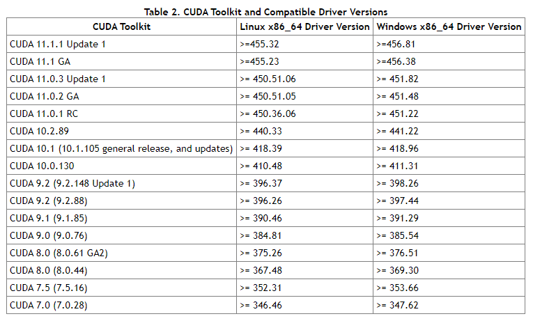

* #### 查看cuda runtime version

  nvcc --version

* #### 查看cuda driver version

  nvidia-smi

* #### cuda toolkit version要与cuda runtime version兼容

* #### cuda toolkit 与 cuda driver version的兼容性



https://docs.nvidia.com/cuda/cuda-toolkit-release-notes/index.html

* #### 安装pytorch with cuda support

conda install pytorch==1.5.0 torchvision==0.6.0 cudatoolkit==10.1 -c [source (e.g. pytorch)]

pytorch与cudatoolkit对应版本\
https://pytorch.org/get-started/previous-versions/

验证是否安装成功：

```python
import torch
print(torch.cuda.is_available())
```

如果使用的时候出现以下情况则cuda不可用：\
No CUDA runtime is found, using CUDA_HOME='...'