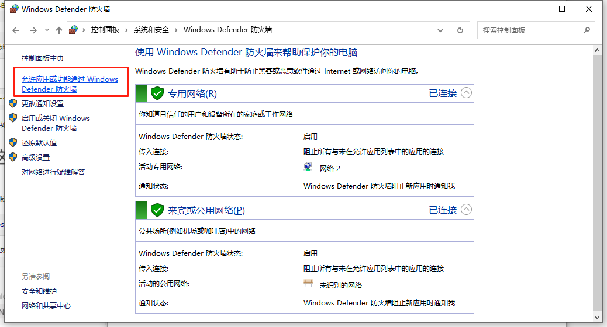
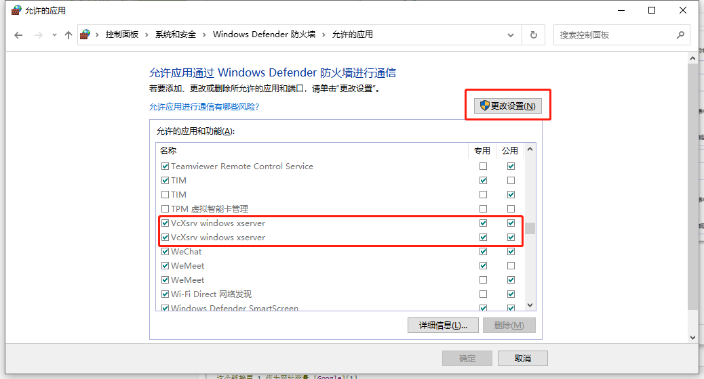
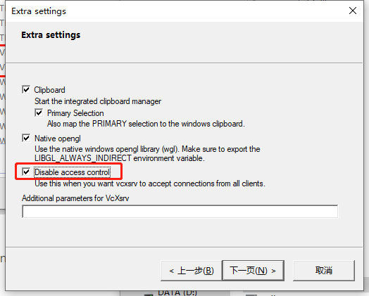

* wsl子系统在windows端显示图形应用(非安装桌面)

1. windows端下载Xming或者[VcXsrv](https://sourceforge.net/projects/vcxsrv/)

2. 允许xserver应用通过防火墙

   

   


3. 启动VcXsrv程序，找到安装目录下的xlaunch.exe，前面的参数默认，勾选Disable access control

   

   

4. 配置wsl子系统环境参数，修改~/.zshrc或~/.bashrc以添加下面一行，并使其生效

```shell
export DISPLAY=$(cat /etc/resolv.conf | grep nameserver | awk '{print $2}'):0
```

5. 可以试试下载一些小程序看是否能够显示

```shell
sudo apt install x11-apps
xeyes
```


6. 如果要在wsl下显示matplotlib画的图，应该还需要安装TkAgg库，如果有则应该不需要安装(没check过下面这行命令的正确性以及有效性)

```shell
sudo apt-get install python3.6-tk(改成对应的python版本)
```


