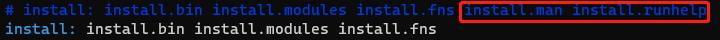
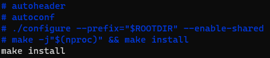

有sudo权限安装zsh:
1. 查看系统中有无zsh
    
```shell
    cat /etc/shells
```    
    
2. 若无，安装zsh

```shell
    sudo apt-get install zsh
```

3. 更改默认shell为zsh

```shell 
    sudo chsh -s $(which zsh)
```
或
```shell script
    echo '[ -f $ZSH_PATH ] && exec $ZSH_PATH -l' >> ~/.bash_profile
    echo '[ -f $ZSH_PATH ] && exec $ZSH_PATH -l' >> ~/.bashrc
```

   退出登录使修改生效

4. 查看默认shell

```shell
    echo $SHELL
```

无sudo权限安装zsh:
```shell
   reference: https://github.com/innerlee/setup
```
如果在安装过程中出现错误，可去掉安装失败的部分，如下图所示是我将安装目录~/app/zsh/src/Makefile文件修改的部分


同时也要修改zzzsh.sh文件，make命令会重新生成Makefile文件，所以要将其注释掉(但是至少得安装过一遍之后才能注释掉)


执行命令
```shell script
echo '[ -f $HOME/app/bin/zsh ] && exec $HOME/app/bin/zsh -l' >> ~/.bash_profile
echo '[ -f $HOME/app/bin/zsh ] && exec $HOME/app/bin/zsh -l' >> ~/.bashrc
```
这两行命令的作用是启动zsh，chsh也是启动zsh，但是它会在/etc/shells里面找，chsh这个命令需要root权限，而如上两行不需要

修改完后重新登录或者source ~/.bashrc

5. 安装oh my zsh

```shell
    wget https://github.com/robbyrussell/oh-my-zsh/raw/master/tools/install.sh -O - | sh
```    
   -O - 表示在终端展示文件内容

6. (option)修改oh-my-zsh的主题\
   查看已有主题
```shell
    ls ~/.oh-my-zsh/themes
```
   在~/.zshrc中修改 ZSH_THEME=“ys”  或其他主题
```shell
     source ~/.zshrc
```

7. 安装oh-my-zsh插件

```shell
   cd ~/.oh-my-zsh/custom/plugins/
```
   * zsh-syntax-highlighting  使语法高亮
```shell
     git clone https://github.com/zsh-users/zsh-syntax-highlighting
```
   在~/.zshrc里找到 plugins=(git) ，在括号里加入zsh-syntax-highlighting(不要加逗号，以空格隔开)

   * autojump 不用输入完整路径即能跳转到文件目录 j dir \
     必须是之前cd过才能自动跳转
```shell
     git clone https://github.com/wting/autojump
     cd autojump; python install.py
```
   重启终端 \
   在~/.zshrc里加入如下命令
```shell
     [[ -s ~/.autojump/etc/profile.d/autojump.sh ]] && . ~/.autojump/etc/profile.d/autojump.sh
```
   * zsh-autosuggestions  命令自动补全
```shell
     git clone https://github.com/zsh-users/zsh-autosuggestions
```
   在~/.zshrc里加入 plugins=(* zsh-autosuggestions)

     

#### 安装完以后别忘记将~/.bashrc里的各种环境变量迁移过来，例如anaconda初始化

